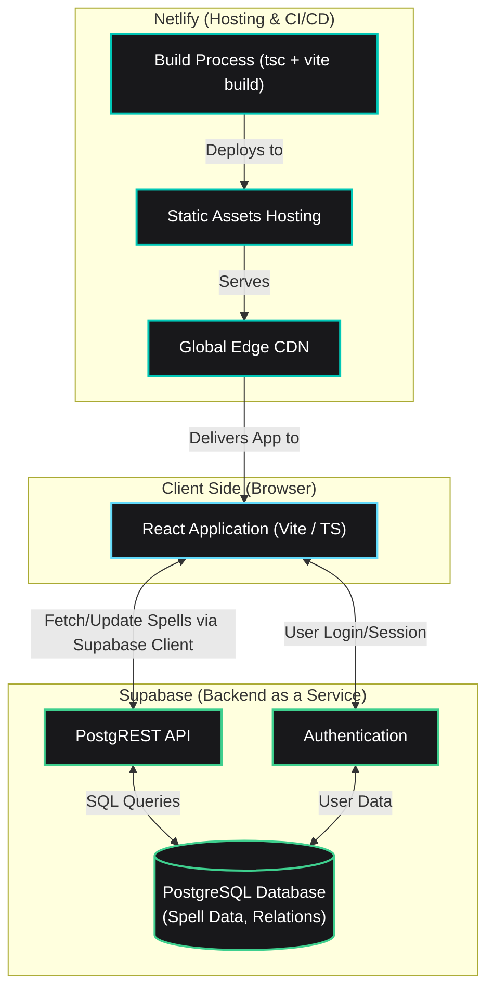

# Infrastructure Architecture

This diagram shows how the frontend, hosting, and backend services are connected to power your Myranor Spell Dashboard.

```mermaid
flowchart TD
    subgraph Client ["Client Side (Browser)"]
        UI["React Application (Vite / TS)"]
    end

    subgraph Netlify ["Netlify (Hosting & CI/CD)"]
        CDN["Global Edge CDN"]
        Hosting["Static Assets Hosting"]
        Build["Build Process (tsc + vite build)"]
    end

    subgraph Supabase ["Supabase (Backend as a Service)"]
        API["PostgREST API"]
        Auth["Authentication"]
        DB[("PostgreSQL Database\n(Spell Data, Relations)")]
    end

    %% Deployment flow
    Build -->|Deploys to| Hosting
    Hosting -->|Serves| CDN
    CDN -->|Delivers App to| UI

    %% Data flow
    UI <-->|Fetch/Update Spells via Supabase Client| API
    UI <-->|User Login/Session| Auth
    API <-->|SQL Queries| DB
    Auth <-->|User Data| DB

    %% Styling
    classDef frontend fill:#18181b,stroke:#61dafb,stroke-width:2px,color:#fff
    classDef hosting fill:#18181b,stroke:#00c7b7,stroke-width:2px,color:#fff
    classDef backend fill:#18181b,stroke:#3ecf8e,stroke-width:2px,color:#fff

    class UI frontend
    class CDN,Hosting,Build hosting
    class API,Auth,DB backend
```
